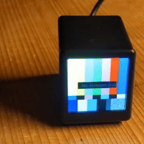

# Netshlix

**Work in Progress**



Displays an RTP/JPEG stream on a [Smalltv-pro](https://github.com/GeekMagicClock/smalltv-pro) (240x240 px LCD).

The roll-your-own minimal [RTP/JPEG stack](components/rtpjpeg) incl. jitterbuffer also runs on Linux and is fully tested and fuzzed.

## Build and deploy

This is an [ESP-IDF 5](https://github.com/espressif/esp-idf) project.

```bash
source $IDF_PATH/export.sh
export ESPPORT=/dev/ttyACM0

# Configure:
cp sdkconfig.defaults.ci sdkconfig.defaults
# Now, edit WiFi credentials in sdkconfig.defaults

# Build/flash
idf.py build flash

# Lint/format
./format.sh

# Flash and monitor
idf.py -p $ESPPORT flash monitor

# Send frames
gst-launch-1.0 filesrc location=components/rtpjpeg/BigBuckBunny_320x180.mp4 ! decodebin \
    ! videoconvert ! videoscale ! video/x-raw,width=240,height=240 \
    ! jpegenc \
    ! rtpjpegpay seqnum-offset=63000 mtu=1400 \
    ! udpsink host=10.0.0.134 port=1234
```

## C Conventions

- Names: `buf`, `sz`, `out`
- Sizes: `ptrdiff_t`
- Objects: `typedef struct X_t {} X_t`, `init_X(..., X_t *out)`, `X_do(X_t *x, ...)`, `X_destroy(X_t *x)`

## Ideas, TODOs

- [ ] WiFi setup, SoftAP
- [ ] Touch sensor
- [x] RTP/MJPEG
- [ ] HTTP API, image upload
- [ ] Display image from HTTP(s)
- [ ] SPIFFS/littlefs
- [ ] Show boot status on display, during init
- [ ] Grep TODO
